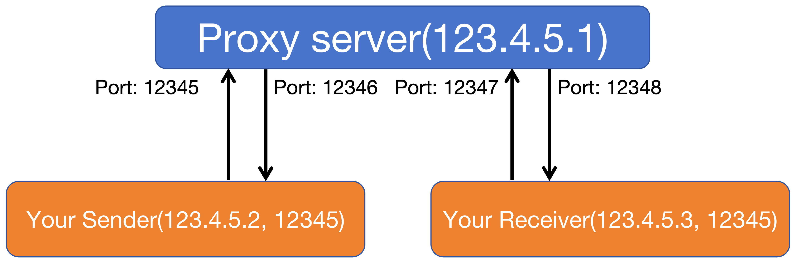

# CS305-2024Spring-FinalProject: Reliable Data Transfer upon UDP

This project focuses on developing a reliable data transfer (RDT) protocol using UDP as the unreliable protocol. Specifically, this project requires you to use UDP as the transport layer protocol and implement an RDT protocol at the application layer. The primary objective is to design and implement a protocol that can address the challenges and limitations of data transfers in an unreliable network environment. The project aims to create a robust and efficient communication protocol by leveraging UDP and exploring various mechanisms for reliable transmission. The protocol will be designed to mitigate issues such as packet loss, delay, data corruption, and congestion, which commonly impact network communication.

**A comprehensive report about the implementation details, insights, and improvements is expected.**

**Please read this project specification carefully and keep track of the updates!!!**.

**IMPORTANT NOTE: We try our best to make this specification as clear as possible and cover all the problems we met during our testing. However, it is not uncommon for us to still miss important details in this specification. If anything is unclear, you should submit issues in this repository or contact the instructors and SAs immediately rather than guessing what you must do. Again, if you have any questions, please confirm with the instructors and SAs before starting**.

Group: This is a group project. You must form a group of 2 or 3 students to complete this project.

## 1 Requirements

### 1.1 Message Format
<!-- To achieve reliable transmission based on UDP, it is necessary to design appropriate protocol fields within the application layer, which sits above the UDP protocol layer. These protocol fields should be incorporated within the UDP packets to facilitate the implementation of reliable transmission mechanisms.

```
+-------------------------+
|   UDP Datagram           |
+-------------------------+
|   UDP Header             |
+-------------------------+
|   Custom Header          |
+-------------------------+
|   Payload            |
+-------------------------+
``` -->

The packet header can be structured based on the table provided.

You should construct your RDT header as the template RDTHeader class, and it should contain the following data fields:

|test_case|Source_address|Target_address|SYN|FIN|ACK|SEQ_num|ACK_num|LEN|RWND|CHECKSUM|Reserved|PAYLOAD|
|:-:|:-:|:-:|:-:|:-:|:-:|:-:|:-:|:-:|:-:|:-:|:-:|:-:|
|1 bytes|6 bytes|6 bytes|1 byte|1 byte|1 byte|4 bytes|4 bytes|4 bytes|4 bytes|2 bytes|8 bytes|LEN bytes|
|Indicate the test case will be used|IP address and port of sender|IP address and port of receiver|SYN in TCP|FIN in TCP|ACK in TCP|Sequence number in TCP|Acknowledge number in TCP|Length of PYALOAD|Size of Receiving window|Chcksum in TCP|Reserved space for adding any additional fields you deem necessary|Data|

We have provided the template code of RDTSocket in *`RDT.py`* and the template code of the RDT packet Header in *`Header.py`*. Based on our `Header.py` file, you could also add some other attributes up to **8 bytes** as  in the field `Reserved`. 

Each field functions similarly to those in the TCP protocol, and you can find detailed information about them through the following [link](https://datatracker.ietf.org/doc/html/rfc9293).

*Please note that during data transmission, all the above data should be encoded to corresponding length bytes and added together following the order in the table above. You should not use the first **3** fields (test_case, Source_address, Target_address) to calculate the `CHECKSUM`. You need to calculate the `CHECKSUM` following the checksum calculation processing of the UDP protocol. `Source_address` and `Target_address` should be formatted by stream.* When some fields are not filled, please follow the padding logic used in our Header.py, `self.to_bytes()` function.

#### CHECKSUM Calculation
In this project, when calculating the CHECKSUM, you should set the `CHECKSUM` field to 0 firstly. Then you should follow the steps below to calculate your `CHECKSUM`.
1. You should join all bytes data together (In the order of SYN, FIN, ACK, SEQ_num, ACK_num, LEN, RWND, CHECKSUM, Reserved, PAYLOAD.). 
2. Didvide the result into 2-byte segments, with each 2-byte segment forming a 16-bit value. If there is a single byte of data at the end, add an extra byte of 0 to form a 2-byte segment.
3. Sum all the 16-bit values to obtain a 32-bit value.
4. Add the high 16 bits and low 16 bits of the 32-bit value to get a new 32-bit value. If the new 32-bit value exceeds 0xFFFF, add the high 16 bits and low 16 bits of the new value again.
5. Take the 1's complement of the result obtained in the previous step to obtain the checksum value, and store it in the checksum field of the data.


### 1.2 Reliable Data Transfer
You are required to implement the following functions for an RDT socket:

#### 1 Accept and establish a connection
You are supposed to implement the functions `bind(), accept(), and connect()`. The function `bind()` could bind the current RDT socket to a specific address. Functions *accept()* and *connect()* are used to establish a connection between the client and server. You are supposed to implement the 3-way handshake in these two functions. Apart from that, you are also supposed to demultiplex the data received from UDP to different sockets, implementing the Socket's multiplexing. In other words, when maintaining multiple sockets simultaneously, *the buffer space for each socket should be isolated.*

**Function *`accept()`* needs to support multithreading and be able to establish multiple socket connections. Messages from different sockets should be isolated from each other, requiring you to demultiplex the data received at the underlying UDP.**

For example:
```python
# As a Server
server_addr = ("127.0.0.1", 12345)
socket = RDTSocket(...)
socket.bind(target_addr)
server_socket = socket.accept()
```
```python
# As a Client
server_addr = ("127.0.0.1", 12344)
target_addr = ("127.0.0.1", 12345)
socket = RDTSocket(...)
socket.bind(server_addr)
socket.connect(target_addr)
```

#### 2 Packet verification
To ensure reliable data transmission, you are supposed to implement data validation functionality. Specifically, you need to calculate a 16-bit checksum for all fields in the packet except for **`test_case, Source_address, and Target_address`**, and then fill in the `CHECKSUM` field. This ensures that the receiver can perform validation checks upon receiving the data. *You could implement the related feature in both **`send() & recv()`** or define a new function and invoke it when needed.*

#### 3 Retransmitting
Generally, a packet may be lost, corrupted, or delayed in an unreliable network environment. Hence, it is necessary to retransmit these error packets when the above error happens. Specifically, when some packets that have been sent do not receive a response with `ACK=1`, which means that they have not been received successfully, it is necessary to resend those packets. **You should implement this feature following the TCP timeout retransmit.**
<!-- using any strategy you think is suitable. For example, maintain a list of sent data, remove an item from the list when it receives the correct response, and resend the data if no response is received within a set duration. -->

<!-- #### 4 Retransmission request
Sometimes, during the reception of a large amount of data, the receiver may experience timeouts for certain packets that are not delivered, and if the sender does not resend these packets, the receiver needs to send a request to the sender to specify retransmission. This feature should be implemented in both **`recv() & send()`**. -->

#### 4 Data segmentation 
We need to transmit large amounts of data that cannot be sent simultaneously. In such cases, you are supposed to implement a basic data chunking and sorting method to divide a large dataset into multiple small CHUNKs that can be transmitted directly. Additionally, it should ensure that the receiver can reassemble these data chunks into the original large dataset upon receipt. This feature should be implemented in **`send()`** For example,
```python
target_addr = ("123.4.5.6", 12345)
socket = TCPSocket(...)
socket.bind(target_addr)
with open('test.txt', 'r') as f:
    data = f.read()
    socket.send(data=data)
socket.close()
```

In the testing section, we have **a strict limit on the size of each chunk**, and you need to stick to that limit.

#### 5 Pipeline manner
Sequential transmission must wait for confirmation of the previous packet, which is inefficient. In such cases, data transmission must be done in a PIPELINE manner. You can transmit multiple packets simultaneously without waiting for confirmation of the previous packet. The number of in-flight packets is limited by the **RWND** and congestion window. In addition, you are also supposed to implement TCP **fast retransmission** when implementing the pipeline to ensure that anomalies such as packet loss in the pipeline can be detected and the lost packets can be retransmitted.


#### 6 Congestion control & Flow control

In this part, you are supposed to implement the congestion and flow control mechanisms following the TCP Reno.
#### 7 Close connection
You are supposed to implement the 4-way handshake to close a reliable connection in **`close()`** function.

# 2 Testing & Grading
## Environment
You must independently implement each function using only the standard libraries provided with Python; no external libraries are permitted. We will test your implementation in an environment running **Python 3.9.0**. Note that the use of the **socket library** is restricted solely to functions related to the **UDP** protocol.


## 2.1 Test system
When testing your RDTSocket, you should make our proxy server as your target server. Make sure that your **real target server address & port** have been stored in *Target_address* and the IP address and port of your host have been stored in *Source_address*. Please note that the content of the first 13 bytes (test_case, Source_address, Target_address) will still be preserved after passing through the proxy server.

<p align="center">
  
</p>

A complete test system example is structured as shown in the figure above, where the proxy server will be deployed by us (we will let you know the information of this proxy server). You are required to use your RDTSocket implementation for Sender and Receiver during testing. All interactive data must pass through our proxy server for forwarding. Our proxy server will simulate the unreliable network environment (lost, corruption, delay, etc.) based on the **test_case** field set in the headers of the data you transmit.

To facilitate smoother testing, please adhere to the following guidelines by using the IP address and port of our official proxy server when conducting tests.

## 2.2 Guidelines
When the network environment is like the example figure above. Due to the header size totaling **42 bytes**, we have set the maximum data size that can be received once in the proxy server to **298 bytes.** Any excess beyond this size will be discarded. Therefore, please ensure that the size of each packet you send does not exceed 256 bytes, which means the length of *PAYLOAD* should not be larger than **256** bytes. For example, as shown in the figure above, 

1. Please ensure that your Sender correctly saves the real destination address `("123.4.5.3", 12345)` and local address `("123.4.5.2", 12345)` in the header when sending data. The socket should be configured to send data to the address `("123.4.5.1", 12345)` during data transmission.
2. Our proxy server will parse the first **13 bytes** of your data upon receipt to extract the *test_case, Source_address, and Target_address*. It will then simulate an unreliable network based on the `test_case` you set before forwarding your data to your receiver.
3. Please ensure that your Receiver correctly fills in the real Sender address `("123.4.5.2", 12345)` and local address `("123.4.5.3", 12345)` in the header when sending data. The socket should be configured to send data to the address `("123.4.5.2", 12345)` during data transmission and keep listening to the local address `("123.4.5.3", 12345)`.

<!-- ```python
target_addr = ("123.4.5.6", 12345)
socket = RDTSocket()
socket.connect(target_addr)
``` -->


## 2.3 Testing
You should implement an RDTSocket based on the requirements. 
We will use a proxy SERVER to test your project. When using your RDTSocket to build a server and client to communicate with each other, all data sent will pass through our proxy server. Therefore, construct your data packages carefully based on our RDTHeader template. Please note that our proxy SERVER assumes that the data will be delayed/lost/corrupted based on different test cases.

The total score is 100 points, plus a bonus of up to 20 points.

**How to test your RDTSocket?**

You can test it through our deployed proxy server. Therefore, you must include a `test_case` field in your packet header (no need to calculate it in the `CHECKSUM`). When test_case is 0, it represents a reliable network environment without any packet loss or corruption operations. When test_case ranges from 1 to 10, it will test various functions of RDTSocket. When sending test data for testing, the packet header should include sender's IP and port, receiver's IP and port, as well as test_case, to complete data forwarding and network simulation operations.
The IP address and test port of the testing server will be released later.

## 2.4 Grading
1. Establish (3-way handshakes) & close (4-way handshakes) connection. (5 pts)
2. Demultiplexing directs the data received from UDP to different sockets. (10 pts)
3. Calculation and verification of the CHECKSUM correctly. (5 pts)
4. Complete data segmentation. (5 pts)
5. Your RDTSocket could be used as a client to send multiple short messages to the server built by your RDTSocket. (10 pts)
6. Your RDTSocket could be used as a server to receive a large file from a client built by your RDTSocket. The file should be separated into multiple CHUNKs and will be sent in a disordered sequence, with some packets being lost. Your RDTSocket should receive and buffer all this data and recover it to the original file based on the sequence number of each packet. If the RDTSocket detects lost packets, it should be able to detect missing packets and receive them from the retransmitted data sent by the client. (20 pts)
7. Your RDTSocket could be used as a client to send a large file to the server built by our RDTSocket. This file should be separated into multiple CHUNKs and sent in a PIPELINE way. During testing, we will delay data packets to simulate congestion situations. **Please ensure your RDTSocket can maintain the sizes of the congestion control window and flow control window** to control the sending and receiving speed of data and stop sending data when the server is congested. Resume sending data only when notified by the server that it can receive data again. Sending more than 30% of data beyond the buffer will be considered a failure to complete the flow control function. (30 pts)

<!-- 6. We will prepare different test cases to test the performance of your RDTSocket. (total 25 pts) -->
8. You should be able to **clearly** explain your code to the examinators to demonstrate that your related feature has been implemented.

9. You must submit a report explaining how each function is implemented, including the performance analysis of RDT.（15 pts）

**Bonus**: You can implement additional mechanisms to improve the RDT performance. If you have any ideas, please confirm with the instructors or SAs before you start. **(20 bonus pts)**

We will give the bonus points based on the performance of your implemented sockets. The metrics to evaluate the performance of your RDTSocket are **throughput of your socket/throughput of python UDP and lantency of your socket/lantency of UDP** (tentatively). 
We will set a baseline (to be announced later) for these metrics. Only the groups that perform better than the baseline can get bonus points. We will rank your performance among all the groups in the class.
You must show the performance during the final demonstration.

<!-- ## 2.2 Presentation (30 pts)
For the final demonstration:
1. Add a debug mode to the RDTSocket to print out information about the transmission process.
2. Introduce how you implemented all the mechanisms, such as congestion control, flow control, and the pipeline.
3. Explain how you tested and evaluated the performance of your implementation.

You will need to create a video of about 5-8 minutes containing the contents described above. -->

# 3 Notes

- Do not use any existing third-party libraries.
- The data sent during testing consists of long texts.
- Provided code:

    1. *Header.py*: provides the data structure of the RDT packet header.
    2. *RDT.py*: provides the template and necessary interface of your RDT Socket.

- Suggested steps:

    1. Assume a reliable link and infinite buffer, complete basic connection management.
    2. Assume the link becomes unreliable, try to fix the issues of loss, corruption, and delay.
    3. Add congestion control and flow control mechanisms.
    4. To fulfill the bonus requirement, create a pipeline mode for your RDTSocket.

# Contact
If you have any questions about this project, please start a new issue.

# Update log

- 2024/05/15:
    1. RDT.py, line 60: We add a new parameter `test_case` to the function `send()` to indicate which test case will be used.
    2. Header.py, line 33: An logical error in function `to_bytes()`. It has been fixed.
    3. We emphasize that during data transmission, please note that the **UDP socket** used at the lower level should send the header converted into a byte stream to the address of the proxy server, **not the actual destination address**. The real destination address is saved in the `Target_address` field of the header, which the proxy server will retrieve and then forward the data accordingly. Detailed about how to modify these two test script, please refer to the comments in thiese two files.
    4. Address of proxy_server has been released. **Please note that you have to connect to the SUSTech network.**

        |Name|Description|IP|Port|
        |:-:|:-:|:-:|:-:|
        |FromSender|The destinatiion that the sender should send the data to.|10.16.52.94|12345|
        |FromReceiver|The destinatiion that the receiver should send the data to.|10.16.52.94|12347|
        |ToSender|The destinatiion that the sender should receive the data from.|10.16.52.94|12346|
        |ToReceiver|The destinatiion that the receiver should receive the data from.|10.16.52.94|12348|
        |ProxyServerAddress|During the testing process, after completing the testing of each case, test_case.py will automatically send a cleanup request to the target.|10.16.52.94|12234|
    5. Details of Bonus
        - In throughput test, you will send a file using RDT and record its spend time. Meanwhile, we will use UDP to send the same size file and record the time. You need to compare the time of RDT and UDP. In our baseline, the throughput of RDT is **40%** of UDP. During the test, you should set **the same chunk size** for UDP and RDT.
        - In lantency test, you will test the lantency of sending a data after establishing an RDT connection. The data is the timestamp of the current system, which you can collect using the time.time() function. Further details are presented in the file `calculate_latency.py`. In our baseline, the lantency of RDT is **120%** of UDP.
    6. We added three test script to this project to test your RDT socket. You could run `test_case.py` , `calculate_throughput.py` and `calculate_latency.py` by
        ```shell
        python test_case.py                 # Test your RDTSocket on different test_case
        python calculate_throughput.py      # Test your RDTSocket throughput locally.
        python calculate_latency.py         # Test your RDTSocket lantency locally.
        ``` 
        Please note that for test_case from 0-3, `test_case.py` will not illustrate your RDTSocket has passed the test or not. For test_case from 4-6, `test_case.py` could show that your RDTSocket has passed the test or not. Otherwise, you could download the test file `original.txt` from [test_file](https://send.cra.moe/file/tvkyHgjI61eVA4cl/8fR7tR7VQdBEywpR/original.txt)
    7. If you have any questions, you could conact SA [Rongyuan Tan](mailto:12231141@mail.sustech.edu.cn) by email or wechat: jzxycsjzy or QQ: 627807228.